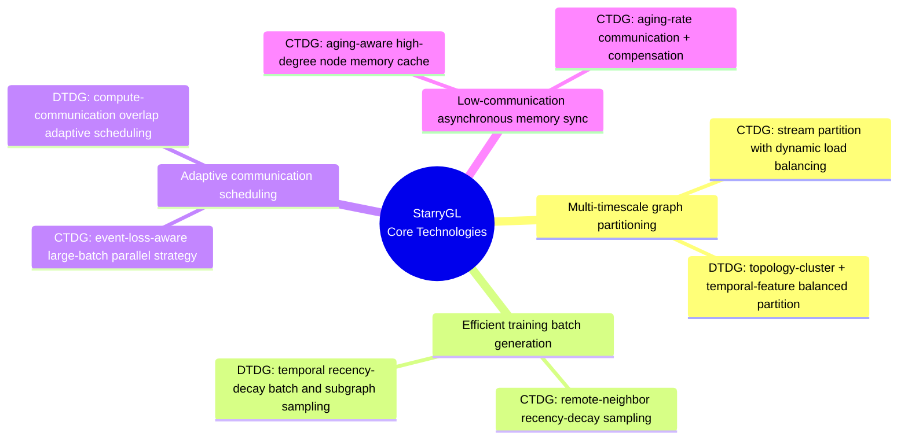
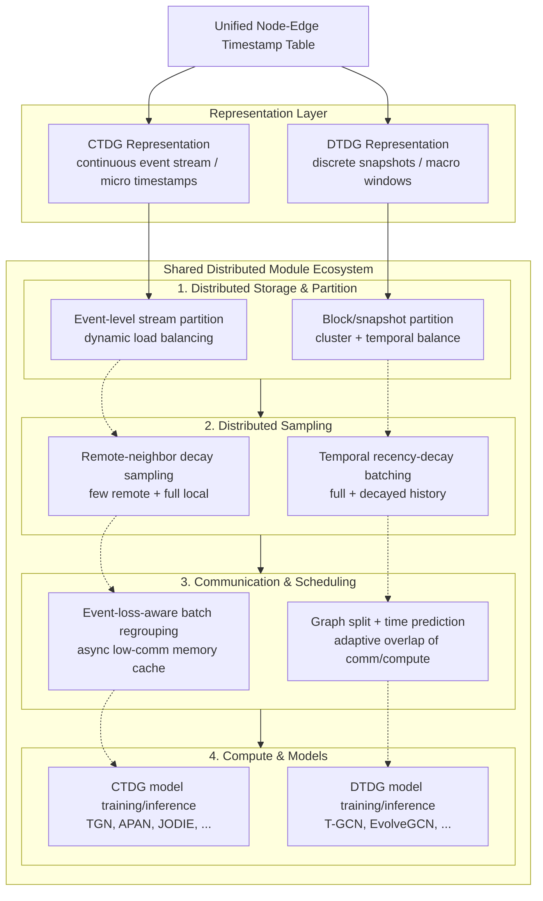

# StarryUniGraph

[中文 README](./README.zh-CN.md) | [Interface Docs](./docs/interface.md) | [中文接口文档](./docs/interface.zh-CN.md)

StarryUniGraph is a unified high-performance training system for large-scale dynamic graphs.  
It is designed to support both **CTDG** (continuous-time dynamic graph) and **DTDG** (discrete-time dynamic graph) under one distributed runtime.

## Core Technical Points

StarryUniGraph's core techniques are organized into four dimensions:



### 1. Multi-timescale graph partitioning
- **CTDG**: stream partitioning with dynamic load balancing for varying time spans.
- **DTDG**: topology-aware clustering and temporal-feature balancing for window-level snapshot sequences.

### 2. Efficient training batch generation
- **CTDG**: remote-neighbor recency-decay sampling (`few remote + full local`) to reduce communication overhead.
- **DTDG**: temporal recency-decay batch generation to reduce expensive subgraph rebuilding.

### 3. Adaptive communication scheduling
- **CTDG**: event-loss-aware large-batch regrouping to improve GPU utilization under temporal memory constraints.
- **DTDG**: adaptive overlap between communication and compute through graph splitting and runtime prediction.

### 4. Low-communication asynchronous memory sync
- **CTDG**: aging-aware thresholded memory synchronization with compensation and high-degree node cache.
- Practical effect: significantly reduced sync traffic while preserving model quality.

## End-to-End Training Flow



### Flow explanation
1. A unified node-edge-time table is transformed into CTDG and DTDG representations.
2. Both branches enter the same distributed module ecosystem.
3. Partitioning, sampling, communication scheduling, and model execution are coordinated under one runtime contract.
4. CTDG/DTDG keep their own kernels while sharing orchestration, artifacts, and distributed infrastructure.

## Interface Documentation

For concrete APIs and contracts, see:
- [English Interface Doc](./docs/interface.md)
- [中文接口文档](./docs/interface.zh-CN.md)

## Quick Start

```bash
# CTDG Flare-style workflow (recommended env: tgnn_3.10)
WORLD_SIZE=8 /home/zlj/.miniconda3/envs/tgnn_3.10/bin/python \
    -m starry_unigraph --config configs/tgn_wiki.yaml \
    --artifact-root /shared/artifacts/WIKI --phase prepare

# run on node 0
/home/zlj/.miniconda3/envs/tgnn_3.10/bin/torchrun \
    --nnodes=2 --node_rank=0 --nproc_per_node=4 \
    --master_addr=node0 --master_port=29500 \
    -m starry_unigraph --config configs/tgn_wiki.yaml \
    --artifact-root /shared/artifacts/WIKI --phase train

# run on node 1
/home/zlj/.miniconda3/envs/tgnn_3.10/bin/torchrun \
    --nnodes=2 --node_rank=1 --nproc_per_node=4 \
    --master_addr=node0 --master_port=29500 \
    -m starry_unigraph --config configs/tgn_wiki.yaml \
    --artifact-root /shared/artifacts/WIKI --phase train

# predict uses the same launch pattern with --phase predict on every node

# DTDG distributed training (example)
bash run_mpnn_lstm_4gpu.sh all
```

## Notes

- The framework is designed to preserve accuracy while scaling distributed throughput.
- In internal/benchmark settings, speedup can reach multi-x gains (up to 6.43x in reported scenarios).
