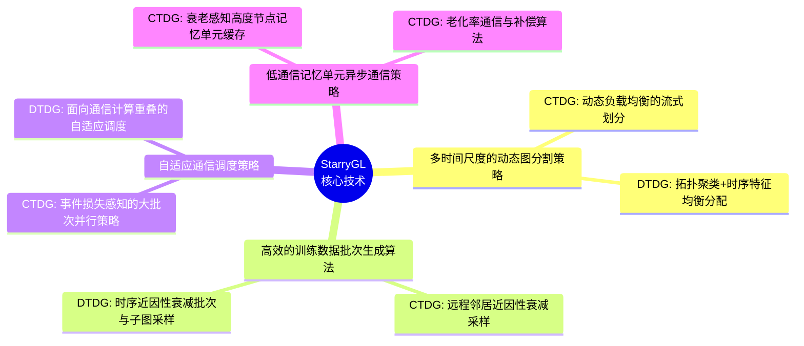
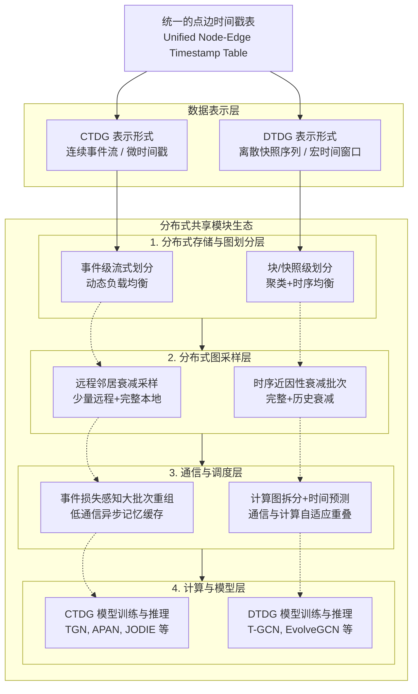

# StarryUniGraph

[English README](./README.md) | [接口文档（英文）](./docs/interface.md) | [接口文档（中文）](./docs/interface.zh-CN.md)

StarryUniGraph 是一个面向大规模动态图的统一高性能训练系统。  
其目标是在同一套分布式运行时中打通 **CTDG**（连续时间动态图）与 **DTDG**（离散时间动态图）两类范式。

## 核心技术点

StarryUniGraph 的核心技术分布在四个维度：



### 1. 多时间尺度动态图分割
- **CTDG**：面向不同时间范围的动态负载均衡流式划分。
- **DTDG**：面向窗口级连续快照的拓扑聚类+时序特征均衡分配。

### 2. 高效训练批次生成
- **CTDG**：远程邻居近因性衰减采样（少量远程邻居 + 完整本地邻域），降低通信与采样成本。
- **DTDG**：时序近因性衰减批次生成，缓解子图重建慢与高通信问题。

### 3. 自适应通信调度
- **CTDG**：基于事件损失感知的大批次重组，提升时序记忆约束下的 GPU 利用率。
- **DTDG**：通过计算图拆分与执行时间预测，实现通信与计算自适应重叠。

### 4. 低通信异步记忆同步
- **CTDG**：采用基于记忆老化率的阈值通信、补偿算法与高节点度缓存。
- 实践效果：在保持精度的同时显著降低同步通信量。

## 完整训练流程



### 流程说明
1. 统一的点边时间戳数据进入系统后分流为 CTDG 与 DTDG 两种表示。
2. 两条链路进入同一套分布式共享模块生态。
3. 在划分、采样、通信调度、模型训练四层中，各自执行专属策略但共享统一基础设施。
4. 最终在统一运行时边界下完成训练、评估、预测与状态管理。

## 接口文档

具体 API 和调用契约见：
- [接口文档（英文）](./docs/interface.md)
- [接口文档（中文）](./docs/interface.zh-CN.md)

## 快速开始

```bash
# CTDG 分布式训练（示例）
torchrun --nproc_per_node=4 train_tgn_dist.py --dataset WIKI --epochs 2

# DTDG 分布式训练（示例）
bash run_mpnn_lstm_4gpu.sh all
```

## 说明

- StarryUniGraph 在保障精度的前提下提升大规模分布式训练效率。
- 在报告场景下，系统加速比可达到多倍（最高可达 6.43x）。
