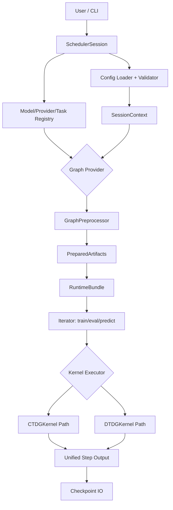
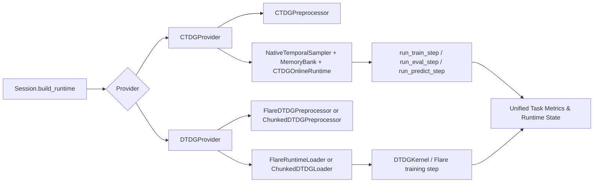
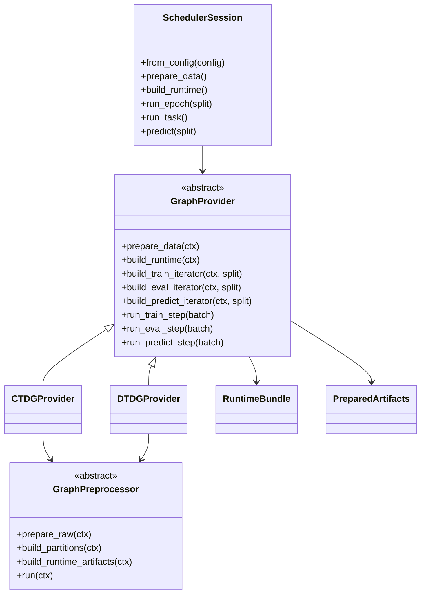

# StarryUniGraph 项目文档（CTDG/DTDG 统一架构）

## 1. 项目背景

StarryUniGraph 面向时序图学习场景，目标是在同一工程体系下同时支持：

- `CTDG`（连续时间动态图）：以事件流和在线状态更新为核心。
- `DTDG`（离散时间动态图）：以快照序列和时间窗口传播为核心。

两类范式在算法执行细节上不同，但在工程生命周期上高度一致：

- 都需要统一配置与校验。
- 都需要数据预处理和 artifacts 产物管理。
- 都需要可复用的 `train / eval / predict` 入口。
- 都需要统一 runtime state 与 checkpoint 边界。

因此本项目采用“上层统一契约 + 下层范式专属内核”的设计。

## 2. 项目框架

### 2.1 总体架构图



### 2.2 双范式执行链路图



### 2.3 模块目录

- `starry_unigraph/session.py`：统一会话入口与生命周期调度。
- `starry_unigraph/config/`：默认配置、合并与校验。
- `starry_unigraph/registry/`：模型/Provider/Task 注册表。
- `starry_unigraph/preprocess/`：预处理抽象与 artifacts 输出协议。
- `starry_unigraph/providers/`：CTDG/DTDG 的 provider 实现。
- `starry_unigraph/core/`：kernel 协议与执行内核。
- `starry_unigraph/backends/`：范式专属后端组件。
- `starry_unigraph/checkpoint/`：checkpoint 读写。
- `starry_unigraph/cli/`：命令行入口。

## 3. 使用配置

### 3.1 最小使用流程

```python
from starry_unigraph import SchedulerSession

session = SchedulerSession.from_config("starry_unigraph/config/default.yaml")
session.prepare_data()
session.build_runtime()
summary = session.run_task()
```

### 3.2 CLI 使用

```bash
# 仅预处理
python -m starry_unigraph.cli.main --config configs/tgn_wiki.yaml prepare

# 训练
python -m starry_unigraph.cli.main --config configs/tgn_wiki.yaml train

# 预测
python -m starry_unigraph.cli.main --config configs/tgn_wiki.yaml predict --split test
```

### 3.3 关键配置项

| 配置路径 | 含义 | CTDG | DTDG |
| --- | --- | --- | --- |
| `model.family` | 模型家族，用于推断 `graph_mode` | `tgn/dyrep/jodie/tgat/apan` | `evolvegcn/tgcn/mpnn_lstm/gcn` |
| `model.task` | 任务类型 | 常用 `temporal_link_prediction` | 常用 `snapshot_node_regression` |
| `graph.storage` | 图数据组织方式 | `events` | `snapshots` |
| `graph.partition` | 分区算法 | 生效 | 生效 |
| `graph.route` | 跨分区路由策略 | 生效 | 生效 |
| `train.snaps` | 快照数量 | 非核心 | 核心 |
| `sampling.*` | 邻居采样参数 | 核心 | 非核心 |
| `ctdg.*` | CTDG 运行参数（mailbox/time attention 等） | 核心 | 非核心 |
| `dtdg.*` | DTDG pipeline 与 chunk 策略 | 非核心 | 核心 |
| `dist.*` | 分布式上下文 | 生效 | 生效 |

### 3.4 产物目录约定

- 共有产物：
  - `meta/artifacts.json`
  - `partitions/manifest.json`
  - `routes/manifest.json`
- CTDG 常见产物：
  - `sampling/index.json`
- DTDG 常见产物：
  - `flare/manifest.json` 与 `flare/part_*.pth`，或
  - `snapshots/manifest.json` 与 `clusters/...`

## 4. 主要功能类

### 4.1 核心类关系图



### 4.2 关键类职责

1. `SchedulerSession`（`starry_unigraph/session.py`）
- 统一入口，负责配置加载、图模式识别、provider 选择和生命周期编排。

2. `GraphProvider` / `BaseProvider`（`starry_unigraph/runtime/base.py`, `starry_unigraph/providers/common.py`）
- 定义统一 Provider 接口，封装预处理、runtime 初始化、step 执行与状态持久化边界。

3. `CTDGProvider`（`starry_unigraph/providers/ctdg.py`）
- 负责 CTDG 预处理、在线 runtime 组装、迭代器构建与训练/推理 step 调用。

4. `DTDGProvider`（`starry_unigraph/providers/dtdg.py`）
- 负责 DTDG pipeline 选择（`flare_native` / `chunked`）、快照加载和内核执行路径管理。

5. `GraphPreprocessor`（`starry_unigraph/preprocess/base.py`）
- 统一 artifacts 构建协议：`prepare_raw -> build_partitions -> build_runtime_artifacts`。

6. `CTDGKernel` / `DTDGKernel`（`starry_unigraph/core/*.py`）
- 分别承载 CTDG 与 DTDG 的执行阶段细节，输出统一 payload 结构。

## 5. 接口含义（按调用层次）

### 5.1 Session 层接口

- `from_config(config_or_path, dataset_path=None, overrides=None)`
  - 作用：加载配置、校验字段、推断 `graph_mode`、构造 `SessionContext` 与 Provider。

- `prepare_data()`
  - 作用：触发 provider 预处理，写出 artifacts 与元数据。

- `build_runtime()`
  - 作用：依据 artifacts 和配置初始化模型、优化器、加载器/采样器、runtime state。

- `run_epoch(split)`
  - 作用：按 split 迭代 batch，聚合 loss 与 metrics。

- `run_task()`
  - 作用：按 epoch 执行 train/eval 主循环。

- `predict(split)`
  - 作用：执行预测迭代并返回 `PredictionResult`。

- `save_checkpoint(path)` / `load_checkpoint(path)`
  - 作用：持久化与恢复 runtime 所需状态。

### 5.2 Provider 层接口

- `prepare_data(session_ctx)`：生成 `PreparedArtifacts`。
- `build_runtime(session_ctx)`：生成 `RuntimeBundle`。
- `build_train_iterator / build_eval_iterator / build_predict_iterator`：提供统一迭代输入。
- `run_train_step / run_eval_step / run_predict_step`：执行一步并返回统一输出字典。

### 5.3 Kernel 层接口

- `iter_batches(split, count)`：产生 kernel batch。
- `execute_train(batch)`：训练步（通常包含 loss/targets）。
- `execute_eval(batch)`：评估步。
- `execute_predict(batch)`：预测步（通常不含 loss）。
- `dump_state()`：导出内核状态，供 runtime 观测和 checkpoint。

## 6. CTDG 与 DTDG 的共性与边界

- 共性：
  - 统一 `Session -> Provider -> Runtime -> Step` 调用协议。
  - 统一 artifacts/version 校验、状态容器和 checkpoint 外边界。
  - 统一任务层 loss/metrics 聚合方式。

- 差异：
  - CTDG 聚焦事件驱动的邻居采样与 memory/mailbox 更新。
  - DTDG 聚焦快照窗口加载、路由与时序传播。

这保证了“工程入口统一、执行语义独立”，有利于在同一项目内持续扩展双范式能力。
